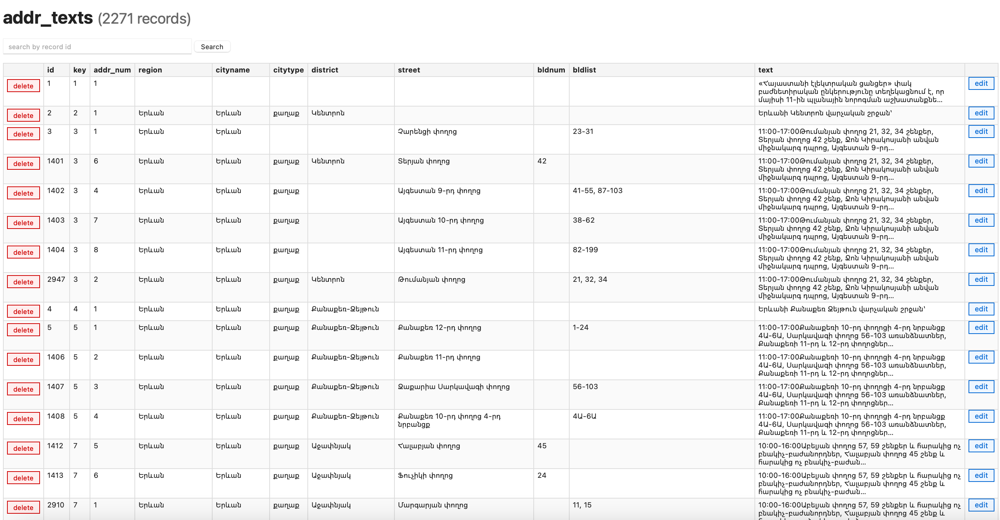
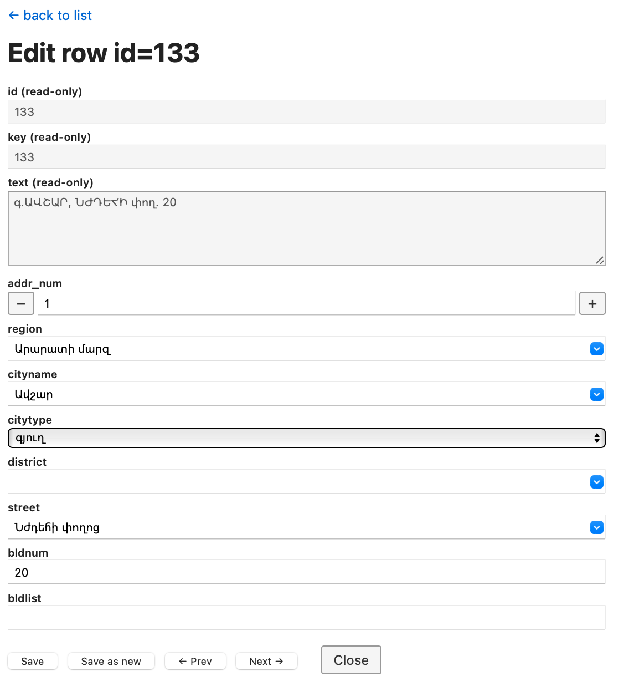

# Armenian Address Parsing and Curation Project

This repository contains tools, data, and models for parsing, annotating, and structuring address information from raw Armenian text (such as public utility maintenance announcements). 

The project includes a Flask annotation web interface, data cleanup scripts, the curated dataset, and LoRA adapters for fine-tuning Llama-3.1-8B to perform automated address extraction.

---

## Repository Structure

```
├── DB/                          # Local PostgreSQL database dump
│   └── addr_dump.sql.gz         # Gzipped SQL dump of schema and data (including osmaddr)
├── Dataset/                     # Curated dataset files for ML training
│   ├── dataset.csv              # Tabular dataset containing address components
│   └── dataset.jsonl            # Pre-formatted JSONL file ready for LLM fine-tuning
├── Model/                       # Model training and fine-tuning assets
│   ├── Finetuning/
│   │   └── addrfitmodel.ipynb   # Google Colab notebook for LoRA training via Unsloth
│   └── llama3_armenian_addresses_lora/ # Fine-tuned LoRA adapters and model card
├── templates/                   # HTML templates for the Flask application
│   ├── base.html
│   ├── index.html
│   └── edit.html
├── UI.png                       # Main dashboard screenshot
├── UI_edit.png                  # Editor interface screenshot
├── app.py                       # Flask annotation web application
├── lowercase_keywords.py        # script to standardize Armenian address casing
├── searchfordoubles.sql         # SQL query to locate duplicates in the database
├── pyproject.toml               # Python project configuration and dependencies
└── uv.lock                      # uv lock file
```

---

## 1. Database Setup & Restoration

A compressed SQL dump of the database (including schema and data for `addr_texts` and `osmaddr` tables) is provided in `DB/addr_dump.sql.gz`. 

To set up the database locally:
1. Create a new PostgreSQL database:
   ```bash
   createdb -U postgres addr
   ```
   *(Or run `CREATE DATABASE addr;` inside the PostgreSQL interactive shell)*

2. Restore the schema and data from the dump:
   ```bash
   gunzip -c DB/addr_dump.sql.gz | psql -U postgres -d addr
   ```

3. Confirm that the tables are created and populated (e.g. `addr_texts` with 2,271 records, and `osmaddr` with lookup records).

---

## 2. Flask Web Application (`app.py`)

The Flask application provides an interface for annotators to review, edit, search, and delete records from the PostgreSQL database.

### UI Screenshots

#### Main Dashboard (Record List)


#### Record Editor (with Autocomplete Lookups)


### Features:
- **Pagination & Search:** Easily browse records (50 per page) or search directly for specific record IDs.
- **Dynamic Address Lookups:** While editing a record, the interface queries a reference table (`osmaddr`) to provide autocomplete suggestions for `region`, `city`, `district`, and `street`. Content for the table 'osmaddr' consists from data available in Open Street Maps database. `db_addresses/db_addresses_new.ipynb` contains an example of script for populating the database with initial values (texts from websites and downloading addresses from OSM)
- **Keyboard-Friendly Workflow:** Navigation buttons allow moving to the previous/next record while saving modifications.
- **"Save as New" Option:** Allows saving edited data as a new row copy while leaving the original record intact.

### Running the App Locally:
1. Make sure you have [uv](https://github.com/astral-sh/uv) or standard Python virtual environment set up.
2. Configure your local environment file (`.env`):
   ```ini
   DB_HOST=localhost
   DB_PORT=5432
   DB_NAME=addr
   DB_USER=elena
   DB_PASSWORD=your_password
   FLASK_SECRET_KEY=dev-secret-key
   ```
3. Run the development server:
   ```bash
   uv run flask run --debug
   ```

---

## 3. Dataset Curation Scripts

- **`lowercase_keywords.py`:** Standardizes Armenian address keywords (e.g. converting title-cased `Մարզ` or `Փողոց` to lowercase `մարզ` or `փողոց`) to ensure training data consistency.
  - Run for a single row: `uv run python lowercase_keywords.py <row_id>`
  - Run for all records: `uv run python lowercase_keywords.py --all`
- **`searchfordoubles.sql`:** A helper SQL script to detect duplicate entries based on overlapping address fields in the database.

---

## 4. Dataset (`Dataset/`)

The structured dataset represents parsed address components from Armenian texts.

### Fields:
* `key`: Group identifier matching the announcement event.
* `text`: Raw Armenian text announcement.
* `region`: Target province or province-level area (e.g. `Երևան` or `Արարատի մարզ`).
* `cityname`: Name of the city/town/village.
* `citytype`: Settlement type label (`քաղաք` or `գյուղ`).
* `district`: Administrative district/neighborhood (e.g. `Կենտրոն`).
* `street`: Street name.
* `bldnum`: Specific building number.
* `bldlist`: Lists or ranges of buildings (e.g. `12`, `23-31`).

*Note: The `dataset.jsonl` contains the data pre-formatted as JSON arrays of objects to facilitate sequence-to-sequence training.*

---

## 5. LLM Fine-Tuning (`Model/`)

The model component contains resources used to train **Llama-3.1 8B Instruct** to perform zero-shot extraction of address elements from Armenian texts into structured JSON arrays.

- **Colab Notebook:** `Model/Finetuning/addrfitmodel.ipynb` contains the pipeline using `unsloth` for 4-bit quantized LoRA fine-tuning.
- **LoRA Adapter:** Weights, configurations, and the tokenizer configuration are stored in `Model/llama3_armenian_addresses_lora/`.
